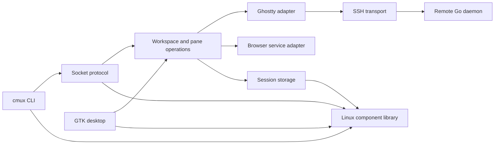

# Architecture

cmux is a native terminal multiplexer. Its product hierarchy is workspace → split pane → sibling terminal/browser surface tabs. The current supported desktop is Linux; portability work isolates operating-system services without pretending a Windows implementation exists.

## Stack and ownership

| Stack | Purpose | Source of version truth | Standard |
| --- | --- | --- | --- |
| Rust, GTK4/GLib, Tokio | Desktop, CLI, protocol, persistence, SSH client | `Cargo.toml`, `Cargo.lock` | [Rust](CodingStandards/Rust.md) |
| Zig and native C/C++ dependencies | Ghostty terminal renderer and PTY engine | Complete `ghostty` submodule and its build manifest | [Zig](CodingStandards/Zig.md) |
| C | Small native window-system bridge | Platform library build | [C](CodingStandards/C.md) |
| Go | Remote PTY daemon | `daemon/remote/go.mod` | [Go](CodingStandards/Go.md) |
| Python | Executable integration scenarios and socket fixtures | Test scripts and CI | [Python](CodingStandards/Python.md) |
| Bash | Setup, build and package orchestration | `scripts`, workflows | [Shell](CodingStandards/Shell.md) |
| YAML, TOML, JSON, Ruby Cask DSL | CI, configuration, package metadata | Workflows and packaging templates | [Configuration](CodingStandards/Configuration.md) |

`agent-browser` is an optional, independently installed external browser service. Its implementation language is not an application dependency to maintain here. Missing installations disable browser panes and show the install command.

The inherited `web` Next.js/React/TypeScript website was removed because the desktop did not load it or need it to build its binaries. The owned legacy audit and verification evidence are recorded in [RefactorAudit](RefactorAudit.md). Keep the complete Ghostty submodule, including upstream platform directories and vendored dependencies.

## Component boundaries

[Components](Components.md) defines responsibilities and concrete source locations. Use small modules and ordinary functions. Extract a library when it provides a real shared boundary, especially operating-system services used by both desktop and CLI. Do not add a plugin framework, service locator, or speculative backend hierarchy.

GTK objects and model mutations stay on the GTK main thread. Parse, validate, deduplicate and coalesce telemetry on workers. Send only necessary mutations to GTK. Keep latest-value data bounded; give streams backpressure and explicit cancellation. Widgets must not retain themselves through callbacks. Free each terminal and remote PTY exactly once.

Each browser surface owns a manager with a unique daemon session; CLI commands, preview metadata and shutdown use that same identity. Browser state from a crashed manager is not adopted automatically.

The browser adapter separates discovery, command transport, frame envelopes, pixel decoding, stream delivery, pointer motion and metrics. JPEG/PNG decoding uses the Rust `image` crate with only those codec features enabled; bounded blocking workers produce shared RGBA bytes for GTK memory textures. Latest-frame channels coalesce preview input. Generic browser RPCs use bounded asynchronous exchanges. History and URL-entry navigation share bounded asynchronous public-CLI subprocesses with widget-driven cancellation. DevTools snapshot requests use the bounded asynchronous socket transport and cancel when their overlay label is destroyed; snapshot display formatting also runs on bounded workers, and only display text returns to GTK. Daemon startup and existing browser restoration run asynchronously under a shared startup transaction. Selecting an existing browser preserves its page and history. Saved browser surfaces start lazily when mapped, with serialized restore admission; hidden unvisited pages do not launch a daemon. Closing a surface retires only its session. Keyboard and click delivery use a bounded ordered queue, with capacity reserved for accepted key releases. Shutdown cancels owned workers and drains bounded daemon-close tasks after GTK exits. Stream-port metadata is read on Tokio filesystem workers inside the owned frame task, with a five-second deadline and a 64-byte advertisement limit; GTK only schedules stream attachment.

Focus is observable protocol behavior. Only operations documented to focus or select may move focus. Persist workspace order and launch settings consistently across CLI and UI operations. Session restore rebuilds app-owned state; it does not checkpoint arbitrary processes. Session resume enhancements are part of the active parity goal. Normal quit freezes a final live snapshot and drains the serialized writer before stopping the runtime.

## Build and verification

Run `./scripts/setup-linux-dev.sh` for a new environment, or `./scripts/setup-linux.sh` when dependencies and Zig are installed. Ghostty builds in ReleaseFast with baseline CPU compatibility. Build binaries with `cargo build --workspace --bins`; build release executables with `cargo build --release --bin cmux --bin cmux-app`. Use the Go version declared by its module.

Do not run tests locally. GitHub Actions runs Rust, Go, packaging and executable integration tests. Test behavior, including lifecycle, focus, persistence, clipboard and memory bounds; do not use source-text or metadata-presence tests as behavior evidence. Use `git diff --check` for documentation and metadata changes. Build and lint locally as needed.

Keep distribution `cmux-gtk`, executables `cmux` and `cmux-app`, application/desktop ID `io.cmux.App`. Keep DEB, RPM, archive, icons, launcher, completions, man page and Homebrew Cask aligned. Package-manager installations must not self-replace through binary updates. Releases respect the Debian 12 glibc ceiling.

Commit directly to `main`; do not create PRs. Main pushes run CI. Only `release-linux.yml` runs for `v*` tags. Before tagging a requested release, bump Cargo version and changelog. The tag workflow publishes archive, checksums, DEB, RPM and Cask. Do not tag documentation-only changes. Push any required Ghostty commits to a reachable remote before changing the parent pointer.

## Documentation and discoverability

[Observability](Observability.md) defines the required end-to-end diagnostics and benchmark coverage. [Gateway patterns](CodingStandards/Patterns.md) records researched guidance and explicit project adaptations.

[Upstream parity](Parity.md) tracks the active capability goal and its monthly release provenance, implementation requirements and verification gates.

Document each owned function at its declaration using native documentation syntax. Describe purpose and meaningful inputs, outputs, errors, ownership, side effects and thread requirements; omit irrelevant boilerplate. Name helpers by behavior so symbol search can locate them. Explain unsafe preconditions and cleanup responsibilities. Keep component docs linked to real modules rather than duplicating source listings. Dependency/generated code follows its upstream rules; do not bulk rewrite it to satisfy local documentation conventions.

Use symbol-aware navigation (`agent-tools symbols`, `symbol`, `search`) for exploration. Documentation should support OKF and tree-sitter through clear declarations and adjacent comments, not through generated prose that repeats function names.

Local transport type selection is centralized in `cmux-platform::local_socket`. Its `async-io` feature exposes Tokio networking without GTK, while blocking CLI connections use the same Linux component. CI checks both minimal and asynchronous platform configurations independently of GTK. Native transport operations retain their existing semantics; application protocol ownership stays outside the platform crate.
