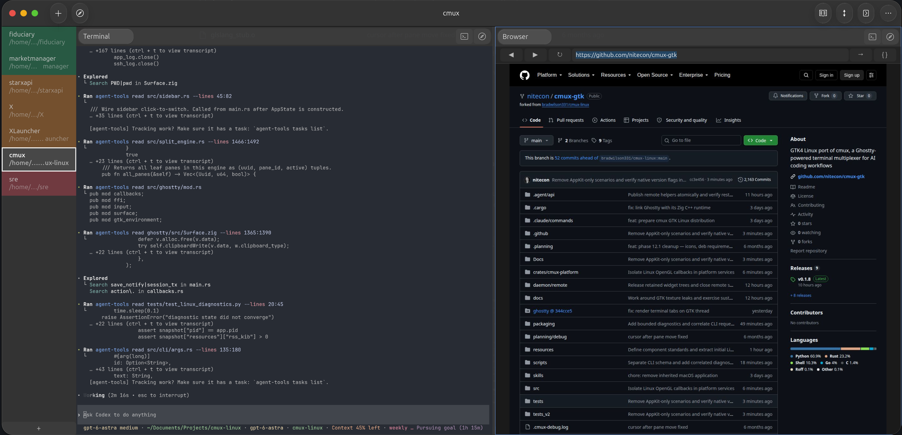

<h1 align="center">cmux GTK</h1>
<p align="center">A GPU-accelerated terminal multiplexer with tabs, splits, workspaces, browser automation, and socket CLI control — powered by Ghostty</p>

> ⭐ **Want a trusted Homebrew install?** Star this repository to help cmux GTK
> qualify for inclusion in Homebrew's official Cask repository. Once accepted,
> users can install it without explicitly trusting a third-party tap.

<p align="center">
  
</p>

## About

cmux for Linux is a full native port of [cmux](https://github.com/manaflow-ai/cmux) (originally a macOS Swift/AppKit app) rebuilt in Rust on GTK4. It provides the same experience — tabs, splits, workspaces, notifications, browser automation, and a scriptable socket API — running natively on Linux with GPU-accelerated terminal rendering via Ghostty.

Built for developers running multiple AI coding agents (Claude Code, Codex, etc.) in parallel who need visibility into which agent needs attention and the ability to script browser interactions alongside terminal sessions.

## Features

- **GPU-accelerated terminal** — Powered by libghostty with GTK4 GtkGLArea rendering
- **Workspaces, tabs, and split panes** — Organize parallel agent sessions
- **Directory-bound workspaces** — Create a workspace with a folder browser; every terminal and split starts in that project directory
- **Notification system** — Per-pane bell tracking, sidebar indicators, desktop notifications
- **In-app browser** — CDP-based browser automation with accessibility tree snapshots, element interaction, and JS evaluation via [agent-browser](https://github.com/vercel-labs/agent-browser)
- **Scriptable CLI** — `cmux` CLI with 34+ subcommands for workspaces, panes, surfaces, and browser control
- **Socket API** — v2 JSON-RPC over Unix socket with SO_PEERCRED auth
- **SSH remote workspaces** — cmuxd-remote deployment with bidirectional PTY proxy and reconnect
- **Ghostty compatible** — Reads your existing `~/.config/ghostty/config` for themes, fonts, and colors
- **Session persistence** — Atomic save/restore of full split tree topology with divider ratios
- **Agent lifecycle integration** — Native resume and notification hooks for Claude, Codex, Grok, Gemini, Copilot, CodeBuddy, Factory, Qoder, OpenCode, Cursor, Pi, and Amp
- **Claude Code teams** — `cmux claude-teams` opens named teammates as native cmux panes with agent hooks and notifications

## Workspace workflows

Use **New Workspace** (`Ctrl+N`) to choose a local folder and optionally a POSIX
startup script. The script runs in each new terminal and again after restart;
exported variables and directory changes are inherited by the shell. Leave the
script empty for a normal terminal. A script can also launch a custom remote
session, for example with `exec ssh -t my-host`.

Use **New SSH Workspace** (`Ctrl+Shift+S`) for a daemon-backed SSH workspace.
Enter an SSH config alias or `user@host`, with an optional absolute remote
folder. SSH key/agent authentication must already work without prompts. Prepare
the local remote-daemon binary with `./scripts/install-cmuxd-remote.sh`; cmux
uploads it on connection. Splits and terminal tabs stay remote. Restart restores
the host, folder and layout; reconnect starts fresh shells, so use a remote
session manager if you need processes to survive a disconnect.

Workspace subtitles show `/first/…/basename`, the startup script, or
`ssh://host/path`. Hover for the full location. Drag sidebar rows to reorder them,
or use **Move Up/Down** in the context menu. **Background Color** provides a
palette and a Default reset. Order and colors are saved with the session.

In terminals, **Ctrl+Shift+C/V** copies and pastes the standard clipboard.
Selecting text automatically makes it available to **middle-click paste** through
Linux PRIMARY selection. Ghostty's `copy-on-select` configuration still applies;
its Linux default is `true`.

The [six-month upstream review](docs/research/upstream-2026-09.md) records which
upstream features informed this port and which are candidates for later work.

## Install

### Homebrew on Linux (recommended)

Homebrew 6 requires explicit trust before loading Casks from third-party taps.
Trust only the cmux GTK Cask, then install it:

```bash
brew tap nitecon/cmux-gtk
brew trust --cask nitecon/cmux-gtk/cmux-gtk
brew install --cask nitecon/cmux-gtk/cmux-gtk
```

The trust decision is stored by Homebrew for future upgrades. It applies only
to `cmux-gtk`, not every current or future Cask in the tap.

```bash
brew upgrade --cask cmux-gtk
```

Launch cmux from your desktop application menu or run `cmux-app`. The installed
commands are `cmux` and `cmux-app`.

### Debian / Ubuntu (.deb)

```bash
sudo dpkg -i cmux-gtk_0.1.0_amd64.deb
sudo apt-get install -f  # install dependencies if needed
```

### Fedora / RHEL (.rpm)

```bash
sudo rpm -i cmux-gtk-0.1.0-1.x86_64.rpm
```

### Build from source

```bash
# Prerequisite: Rust toolchain (the setup script installs system libraries and Zig)
git clone --recurse-submodules https://github.com/nitecon/cmux-gtk.git
cd cmux-gtk
./scripts/setup-linux-dev.sh # install dev dependencies and build libghostty
cargo build --release --bin cmux --bin cmux-app
```

cmux uses an existing `agent-browser` from `CMUX_AGENT_BROWSER`, `PATH`, or its
package installation path. Browser panes remain disabled when it is absent and
cmux prints the upstream installation command. This keeps agent-browser optional
and independently upgradeable.

### Direct binary install

```bash
curl -fsSL https://raw.githubusercontent.com/nitecon/cmux-gtk/main/scripts/install-linux.sh | bash
```

Direct binary installs check for updates quietly at most once per hour. Run
`cmux update` to update immediately, or set `CMUX_NO_UPDATE=1` to disable
automatic checks. Homebrew, Debian, RPM, and AppImage installations remain
owned by their package manager.

## Browser Automation

Agents running inside cmux can discover and use browser automation via the `cmux browser` CLI:

```bash
# Open a site (https:// auto-prepended if no scheme)
cmux browser open slashdot.org            # returns surface:1 handle
cmux browser open gmail.com --profile Default  # reuse an agent-browser Chrome profile

# Interact with the page
cmux browser surface:1 snapshot --interactive  # accessibility tree with element refs
cmux browser surface:1 click e3               # click element by ref
cmux browser surface:1 fill e5 "search term"  # fill input field
cmux browser surface:1 eval 'document.title'  # evaluate JavaScript

# Navigation
cmux browser surface:1 goto example.com
cmux browser surface:1 back
cmux browser surface:1 forward
cmux browser surface:1 reload

# Management
cmux browser list                          # list browser surfaces
cmux browser close --surface surface:1     # close a surface
```

`--profile` accepts the Chrome profile name or persistent profile directory supported by
`agent-browser`. The selector belongs to that browser surface, appears in `browser list`, and
survives cmux session restoration. Omitting it creates the existing isolated ephemeral context.

Browser commands default to JSON output (agents are the primary consumers). Use `--no-json` for human-readable output.

## CLI Reference

```bash
cmux --help                    # all commands
cmux browser --help            # browser subcommands

# Terminal management
cmux list-workspaces           # list all workspaces
cmux new-workspace --cwd ~/src/project --name project  # create a directory-bound workspace
cmux list-surfaces             # list terminal surfaces
cmux split --direction horizontal  # split current pane
cmux list-panes                # list all panes

# Agent teamwork
cmux hooks setup               # install every detected supported agent hook
cmux hooks setup codex         # install only Codex lifecycle hooks
cmux claude-teams              # launch Claude teams in native cmux splits
cmux claude-teams --model sonnet  # forward ordinary Claude arguments

# System
cmux identify                  # instance info (version, platform, pid)
cmux ping                      # check connectivity
cmux raw <method> --params '{}' # send arbitrary JSON-RPC
```

Native lifecycle integrations currently cover Claude Code, Codex, Grok,
OpenCode, Gemini CLI, GitHub Copilot, CodeBuddy, Factory Droid, and Qoder. Setup preserves
unrelated provider configuration and binds resume and notification events to the
originating terminal surface.

### Socket Path

The cmux socket is at `$XDG_RUNTIME_DIR/cmux/cmux.sock` (typically `/run/user/$UID/cmux/cmux.sock`).

Override with `CMUX_SOCKET` environment variable or `--socket` flag.

## Agent Skills

When installed via .deb or .rpm, agent skills are available at `/usr/share/cmux/skills/`:

- **cmux** — Core terminal multiplexer skill (workspaces, panes, surfaces, socket CLI)
- **cmux-browser** — Browser automation skill (open sites, interact with pages, extract data)

A `CLAUDE.md` at `/usr/share/cmux/CLAUDE.md` references skill paths so Claude Code discovers them automatically.

## Architecture

See [Architecture](Docs/Architecture.md), [Components](Docs/Components.md), and the linked coding standards for implementation boundaries and contributor guidance.

- **Language:** Rust
- **UI toolkit:** GTK4 via gtk4-rs
- **Terminal engine:** Ghostty (manaflow-ai fork) via libghostty C FFI
- **Async runtime:** tokio + glib spawn_local bridge
- **Browser automation:** agent-browser daemon with CDP protocol
- **Remote sessions:** Go daemon (cmuxd-remote) reused from macOS codebase
- **Socket protocol:** v2 JSON-RPC, wire-compatible with macOS cmux

## Keyboard Shortcuts

| Shortcut | Action |
|----------|--------|
| Ctrl+N | Open the Create Workspace wizard |
| Ctrl+1–8 | Jump to workspace 1–8 |
| Ctrl+Shift+D | Split right |
| Ctrl+D | Split down |
| Ctrl+Shift+W | Close workspace |
| Ctrl+W | Close pane |
| Ctrl+] / [ | Next / previous workspace |
| Ctrl+Shift+Page Up / Page Down | Move selected workspace up / down |
| Ctrl+Tab / Ctrl+Shift+Tab | Next / previous pane |
| Ctrl+Shift+F | Find |
| Ctrl+Shift+K | Clear scrollback |

Shortcuts are configurable via TOML config file. Workspace move overrides are
`move_workspace_up` and `move_workspace_down` under `[shortcuts]`.

## Terminal preferences

Open the window menu → **Preferences** to set the terminal font size (6–72
points). **Apply** updates existing terminals and saves the size for new tabs
and future launches in `~/.config/cmux/preferences.json` (respecting
`XDG_CONFIG_HOME`). Until a size is saved, terminals use their Ghostty configuration.

## Diagnostics

Window size and maximized state are restored on launch. X11 also restores the
last position when that monitor is still available; Wayland controls placement
through the compositor. Window state is saved beside the session in
`$XDG_DATA_HOME/cmux/window-state.json` (normally `~/.local/share/cmux/`).

cmux records startup, pane/tab lifecycle events, and panic backtraces in
`$XDG_STATE_HOME/cmux/cmux.log` (normally `~/.local/state/cmux/cmux.log`). Set
`CMUX_LOG` to use a different path. Desktop-launch output is also available
through `journalctl --user`.

Use `cmux diagnostics --json` for process resources and diagnostic writer health.
Use `cmux --verbose ping` to obtain a trace ID for matching CLI requests to GTK
queue and dispatch timings in the JSONL diagnostic file. New log output rotates
at 8 MiB with one backup (`cmux.log.1`); a full diagnostic queue drops records
instead of blocking the application, and the snapshot reports that count.

## Building Packages

```bash
# Build all release binaries
cargo build --release --bin cmux --bin cmux-app

# Optional: resolve an installed or locally linked agent-browser
./scripts/resolve-agent-browser.sh

# Build .deb
./packaging/scripts/build-deb.sh

# Build .rpm
./packaging/scripts/build-rpm.sh

# Validate packages
./packaging/scripts/validate-deb.sh
./packaging/scripts/validate-rpm.sh
```

## Continuous Integration and Releases

Pull requests and commits to `main` run the development CI suite: formatting,
workspace checks, Clippy correctness vetting, debug builds, unit tests,
remote-daemon tests, and the web typecheck.

Pushing a semantic version tag such as `v0.2.0` runs the Linux release workflow
without rerunning the development suite. It builds against the Debian 12 glibc
baseline, validates the binaries and packages, publishes the tarball, checksum,
DEB, and RPM to the GitHub release, then updates
[`nitecon/homebrew-cmux-gtk`](https://github.com/nitecon/homebrew-cmux-gtk). The workflow
can also be dispatched manually without publishing for an artifact-only dry run.

## License

This project is licensed under the GNU Affero General Public License v3.0 or later (`AGPL-3.0-or-later`).

See `LICENSE` for the full text.

## Upstream

Linux port of [cmux](https://github.com/manaflow-ai/cmux) by [manaflow-ai](https://github.com/manaflow-ai).

Desktop message delivery uses `notify-send` 0.8 or newer and the notification service in your desktop session. DEB/RPM/Homebrew dependencies and the development setup include the helper. For an archive installation, install `libnotify-bin` on Debian/Ubuntu or `libnotify` on Fedora/Arch; inbox messages remain available if desktop delivery fails.

To recover the snapshot archived at the last normal launch, quit cmux and run `cmux-app --restore-previous-session`. The backup lives beside `session.json` as `session.previous.json`; autosaves do not replace it during that run. Missing or invalid backups fail without replacing your current saved session.
